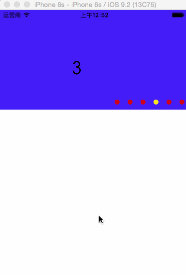

# SJIniteScrollView

This is an infinite photos play framework

#### 效果演示



#### 基本用法

``` swift
    // 创建并设置尺寸
    SJIniteScrollView *initeScrollView = [[SJIniteScrollView alloc] initWithFrame:CGRectMake(0, 0, 375, 200)];
    // 设置数据
    initeScrollView.images = @[[UIImage imageNamed:@"image0"],
                               [UIImage imageNamed:@"image1"],
                               [UIImage imageNamed:@"image2"],
                               [UIImage imageNamed:@"image3"],
                               [UIImage imageNamed:@"image4"],
                               [UIImage imageNamed:@"image5"]
                               ];
    // 设置滚动方向
    initeScrollView.direction = SJIniteScrollViewDirectionVertical;
    // 监听图片点击
    [initeScrollView didSelectItemIndex:^(NSInteger index) {
        NSLog(@"点击第%zd个", index);
    }];
    // 设置pageControl 的一些属性 默认有图片
    initeScrollView.pageImage = [UIImage imageNamed:@"Star1"];
    initeScrollView.currentPageImage = [UIImage imageNamed:@"Star2"];
    // 添加到view中
    [self.view addSubview:initeScrollView];
```

###### 默认pageControl控件在右下角,如需更改位置请子类化,在子类中调整布局

``` swift
- (void)layoutSubviews {
    [super layoutSubviews];
    self.pageControl.frame = CGRectMake(0, 150, 150, 30);
}
```

